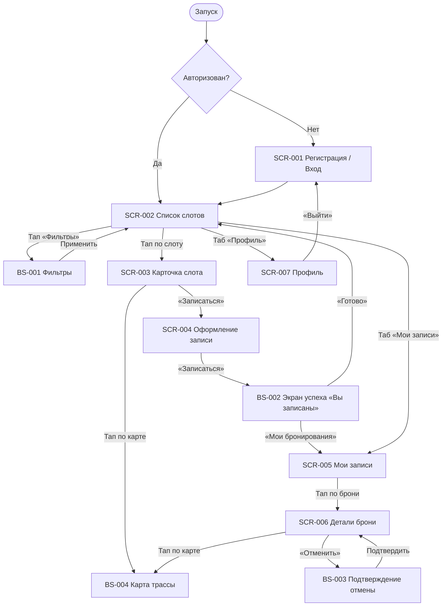

# Фича-лист мобильного приложения «Апекс»

> **Этап 5.** Перечень экранов клиентского приложения и доступных на них функций.
> Связующий артефакт между [требованиями](../2-requirements/) и детальными дизайн-брифами по
> экранам ([`../3-design-brief/`](../3-design-brief/)).

**Статус:** Черновик · **Версия:** 0.1 · **Дата:** 2026-07-03

---

## 1. Назначение

**«Апекс»** — клиентское мобильное приложение для самостоятельной записи на групповые заезды
уличного картинг-центра. Заменяет ручную запись через Telegram и доску маркером, устраняя двойные
брони на карт и путаницу с местами.

**Скоуп приложения — только роль «Клиент».** Маршал и Владелец (Денис) работают через
существующую инфраструктуру/админку и в приложение **не входят**. Справочные данные (слоты,
конфигурации трасс, маршалы) приложение получает из API в режиме **read-only**; оплата —
**офлайн** (наличные / перевод), приложение лишь показывает цену и фиксирует запись.

**Источники:**
[Бриф](../0-customer-brief/customer-brief.md) ·
[Бизнес-требования](../2-requirements/business-requirements.md) ·
[Функциональные требования](../2-requirements/functional-requirements.md) ·
[Нефункциональные требования](../2-requirements/non-functional-requirements.md) ·
[Use cases](../2-requirements/use-cases.md) ·
[User stories](../2-requirements/user-stories.md) ·
[Модель данных](../4-design/data-model.md) ·
[API (OpenAPI, многофайловый)](../api/)

---

## 2. Глоссарий и роли

| Термин | Значение |
|--------|----------|
| **Заезд / Слот** | Конкретный выезд группы: дата, время старта, конфигурация трассы, маршал, цена, всего/свободно мест-картов. |
| **Конфигурация трассы** | Вариант заезда (новичковая / опытная). У каждой конфигурации — свой потолок мест и длительность. |
| **Место-карт** | Одно место в заезде = один карт. Карт всегда выдаётся центром (варианта «свой карт» нет). |
| **Экипировка (прокатный комплект)** | Шлем + подшлемник; может выдаваться напрокат. Подшлемник — предмет личной гигиены, при прокате выдаётся новым. |
| **Запись** | Бронь клиента на слот: число мест-картов (себя + гости), вариант экипировки для каждого места, статус. |
| **Ранняя отмена** | Отмена не позднее чем за 2 часа до старта → места-карты возвращаются в слот. |
| **Поздняя отмена** | Отмена менее чем за 2 часа до старта → запись фиксируется, место-карт **не** освобождается, штрафов нет. |

**Роль приложения:** **Клиент** — просматривает и фильтрует слоты, записывается (себя и гостей),
выбирает вариант экипировки, отменяет записи, получает напоминания.

> **Принцип абстракции.** В фича-листе **не привязываемся к конкретным числам** (размер прокатного
> фонда, потолки конфигураций, длительность). Все лимиты — параметры, приходящие из
> данных/конфигурации слота и трассы.
>
> **Раздельная модель доступности (места-карты ≠ прокатная экипировка).** Места-карты и прокатный
> фонд экипировки считаются **независимо** (картинг — карт всегда центра):
> - **Лимит мест-картов:** `max_seats = min(free_seats, track_config.capacity_cap, 3)` — все
>   значения из данных слота/конфигурации (групповой лимит `3` — «себя + до 2 гостей», FR-12).
> - **Лимит прокатного фонда экипировки:** `rental_count ≤ free_rental_kits`.
>
> «Своя экипировка» занимает место-карт в заезде, но **не** уменьшает прокатный фонд; «Прокатная» —
> занимает место-карт **и** уменьшает прокатный фонд экипировки. То есть доступность мест **не**
> считается «через прокатную экипировку» — это два разных лимита.

---

## 3. Карта навигации

---

## 4. Инвентарь экранов

| ID | Экран | Тип | Назначение | Зона | Приоритет | Требования |
|----|-------|-----|------------|------|-----------|------------|
| **SCR-001** | Регистрация / Вход | Экран | Лёгкий вход по имени и телефону без пароля (SMS OTP) | НЗ | Critical | FR-1, FR-2, FR-43 / UC-4, US-1, US-16 |
| **SCR-002** | Список слотов | Экран | Каталог заездов + фильтры | АЗ | Critical | FR-9, FR-38 / UC-3, US-2, US-3 |
| **BS-001** | Фильтры | Bottom Sheet | Фильтрация списка слотов | АЗ | High | FR-38 / US-3 |
| **SCR-003** | Карточка слота | Экран | Полные параметры заезда перед записью | АЗ | Critical | FR-9a, FR-44 / UC-1, US-4 |
| **SCR-004** | Оформление записи | Экран | Выбор числа мест, вариантов экипировки, цена, запись | АЗ | Critical | FR-10–15, FR-30, FR-45 / UC-1, US-5–8, US-11 |
| **BS-002** | Подтверждение записи («Вы записаны») | Экран | Полноэкранное подтверждение брони со сводкой и двумя кнопками | АЗ | High | FR-30, FR-33 / UC-1, US-5, US-12 |
| **SCR-005** | Мои бронирования | Экран | Список предстоящих и прошедших записей | АЗ | Critical | FR-35a / US-9 |
| **SCR-006** | Детали брони + отмена | Экран | Детали записи и запуск отмены | АЗ | Critical | FR-16–18, FR-46 / UC-2, US-10, US-17 |
| **BS-003** | Подтверждение отмены | Bottom Sheet | Правило 2 часов и подтверждение отмены | АЗ | High | FR-17, FR-18 / US-10 |
| **BS-004** | Карта трассы | Bottom Sheet | Интерактивная карта Яндекс с трассой и местом сбора | АЗ | Medium | FR-9a, FR-44 / US-4 |
| **SCR-007** | Профиль клиента | Экран | Просмотр/редактирование имени и телефона, выход, удаление аккаунта | АЗ | Medium | FR-1, FR-2, FR-47–49 / UC-5, US-18, US-19 |

> **Зоны:** НЗ — неавторизованная зона, АЗ — авторизованная зона.

---

## 5. Сквозные функции (не отдельные экраны)

- **Напоминания / уведомления** (FR-33, NFR-13, NFR-17): заблаговременное напоминание о
  предстоящей записи; уведомление об отмене заезда центром/по погоде. Канал в MVP — **системный
  push** (приложение регистрирует push-токен, доставку обеспечивает существующая инфраструктура).
  Тайминг — **за 24 ч и за 2 ч** до старта (`reminder_hours = [24, 2]`, из ответа `createBooking`).
  Запрос разрешения — после первой записи (BS-002). SMS / email / inbox — Phase 2.
- **Состояния экранов**: единый паттерн Loading (скелетон/шиммер) → Content → Empty (заглушка с
  подсказкой) → Error (с кнопкой «Повторить»). Применяется ко всем экранам с запросами.
- **Offline (NFR-24)**: просмотр кэша с пометкой «данные могли устареть»; мутации (бронь, отмена,
  удаление аккаунта) офлайн недоступны. Единый Error/Retry; таймаут ~10 с; для брони — повтор по
  тому же `Idempotency-Key`.
- **NFR, влияющие на UI**: mobile-first для использования у трассы — крупные элементы, высокий
  контраст, тач-зоны ≥44pt (NFR-1, NFR-25); запись ≤ 3 экранов до подтверждения (NFR-2); отклик
  списка и подтверждения p95 < 2.5 с / < 1.5 с (NFR-21). Приложение — нативное/гибридное,
  распространяется через App Store / Google Play; веб-версии нет.

---

## 6. Не входит в MVP (Phase 2+)

| Функция | Причина / источник |
|---------|--------------------|
| **Рейтинг маршала** (1–5 звёзд + отзыв после заезда) | **Решение зафиксировано: Phase 2** (осознанное сужение скоупа MVP, перенос согласован с заказчиком 2026-06-30). В MVP не входит. |
| **Поделиться заездом (share)** — Phase 2 | На карточке слота [SCR-003](../3-design-brief/SCR-003-slot-card.md) иконка есть, но функция в MVP **не специфицируется** (декор/отложено; RR-D06). |
| Онлайн-оплата | На старте оплата офлайн (BR-8, FR-30); онлайн — за рамками скоупа. |
| Авто-отмена по погоде | Владелец/маршал отменяют вручную, приложение уведомляет; авто-прогноз — позже. |
| Программа лояльности | Бейджи, скидки, приоритетная запись — не в MVP (NFR-16). |
| Публичные отзывы / рейтинги для клиентов | Агрегаты видит только админ; публичный показ — позже. |
| Подбор карта под рост/возраст | На старте не собираем и не учитываем; все карты центра подходят (новичковые ограничения — в типе конфигурации). |
| Мобильные интерфейсы маршала и владельца | Эти роли работают через существующую инфраструктуру/админку. |

---

## 7. Трассировка требований → экраны

| Требование | Покрывающий экран/функция |
|------------|----------------------------|
| FR-1, FR-2, FR-43 (регистрация/авторизация, OTP) | SCR-001, SCR-007 |
| FR-9 (список слотов) | SCR-002 |
| FR-9a, FR-44 (карточка слота, карта/место сбора) | SCR-003 |
| FR-38 (фильтрация) | SCR-002 + BS-001 |
| FR-10–15, FR-45 (запись, экипировка, лимиты, цена) | SCR-004 |
| FR-30 (цена, офлайн-оплата) | SCR-003, SCR-004, BS-002 |
| FR-35a (список своих броней) | SCR-005 |
| FR-16, FR-17, FR-18, FR-46 (отмена, правило 2 ч, отмена центром) | SCR-006 + BS-003 |
| FR-33 (напоминания) | Сквозная функция (§5), BS-002 (запрос push) |
| FR-47–49 (профиль, удаление, logout) | SCR-007 |
| UC-1 (запись) | SCR-002 → SCR-003 → SCR-004 → BS-002 |
| UC-2 (отмена) | SCR-005 → SCR-006 → BS-003 |
| UC-3 (фильтрация) | SCR-002 + BS-001 |
| UC-4 (вход OTP) | SCR-001 |
| UC-5 (профиль/аккаунт) | SCR-007 |

---

## 8. Замечания по данным

- **Рейтинг маршала** — решение зафиксировано: **Phase 2** (осознанное сужение скоупа MVP). В MVP
  функция не входит.
- **API описан** в многофайловой OpenAPI-спецификации [`../api/`](../api/). Домены: **auth**
  (запрос/проверка кода, refresh, logout), **profile** (профиль, смена телефона, удаление),
  **slots** (список/фильтрация и карточка, read-only), **bookings** (создание, список, отмена),
  **marshals** (справочник, read-only).
- **`marshal_id` может быть `null`** в слоте (расписание опубликовано до назначения маршала): в
  SCR-002/SCR-003 поле маршала не показывается или выводится «Маршал будет позже»; запись доступна
  при `free_seats > 0`.
