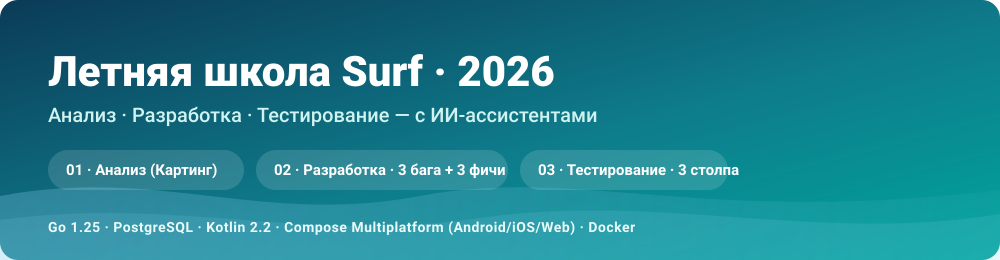
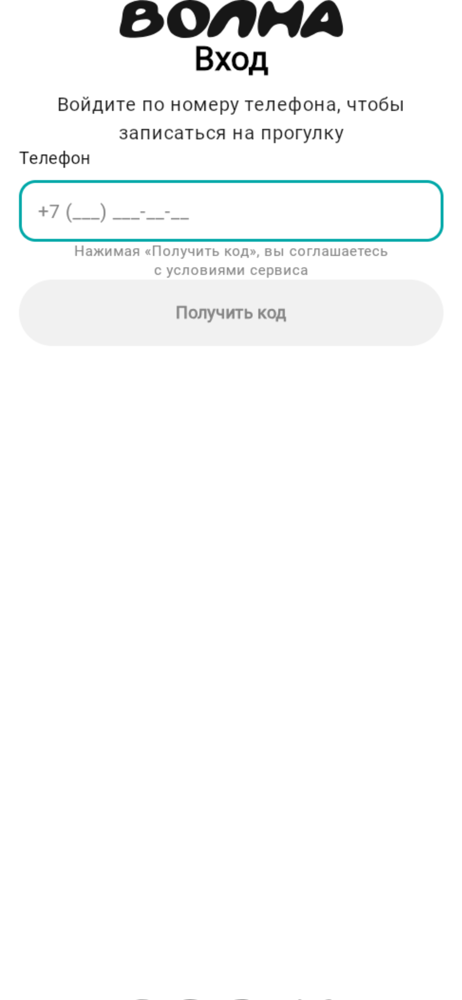
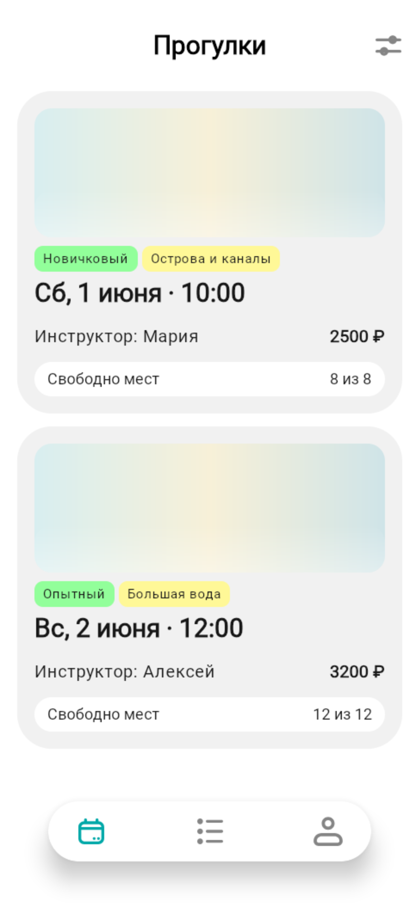
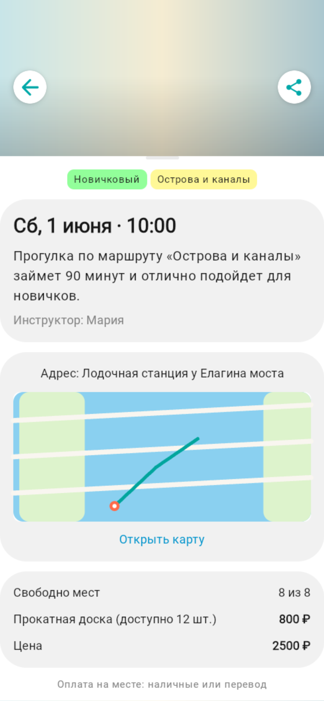

<p align="center">
  
</p>

<p align="center">
  
  
  
  
  
  
  
</p>

<h1 align="center">Летняя школа Surf 2026 — задание</h1>

<p align="center">
  Полный цикл <b>Анализ → Разработка → Тестирование</b> с ИИ-ассистентами на несложном e-commerce.<br/>
  Домен по брифу — <b>Картинг-центр</b>; разработка и тестирование — на референсе <b>«Волна»</b>
  (Go backend + Kotlin Multiplatform клиент), как разрешено организаторами.
</p>

---

## 🧭 Структура репозитория

| Папка | Блок | Что внутри |
|-------|------|------------|
| [`00-analysis-karting/`](00-analysis-karting/) | **Блок 1 · Анализ (Картинг)** | требования (BR/FR/NFR/US/UC), архитектура, схема данных, дизайн-брифы, **промпты** |
| [`01-analysis/`](01-analysis/) | Анализ «Волны» (референс) | спецификации-основа для разработки/тестирования |
| [`02-development/`](02-development/) | **Блок 2 · Разработка** | 3 бага + 3 фичи (по `.md` на каждую) + ревью сабагентами |
| [`03-testing/`](03-testing/) | **Блок 3 · Тестирование** | ревью требований, тест-кейсы (MD+YAML), автотесты |
| [`backend/`](backend/) | Код · Go API | слоёная архитектура, PostgreSQL, интеграционные тесты |
| [`client/`](client/) | Код · KMP клиент | Compose Multiplatform (Android/iOS/Web-wasmJs) |
| [`SUBMISSION.md`](SUBMISSION.md) | 📄 Сводка | краткое описание задания и соответствие требованиям |

---

## 🐞 Блок 2 · Разработка — 3 бага + 3 фичи

| # | Что | Тип | Документ |
|---|-----|-----|----------|
| **B1** | OTP-код не отдаётся вне dev (безопасность) | баг | [B1](02-development/tasks/B1-otp-code-leak.md) |
| **B2** | Двунаправленная сортировка списка броней под пагинацию | баг | [B2](02-development/tasks/B2-booking-list-sort-order.md) |
| **B3** | Dockerfile Go 1.23→1.25 (сборка образа) | баг | [B3](02-development/tasks/B3-dockerfile-go-version.md) |
| **F1** | `route.geometry` в `/slots` (бэкенд) | фича | [F1](02-development/tasks/F1-route-geometry-slots.md) |
| **F2** | Карта рисует маршрут по реальной geometry (клиент) | фича | [F2](02-development/tasks/F2-route-map-geometry.md) |
| **F3** | `/auth/refresh` — access+refresh, ротация, logout по сессии | фича | [F3](02-development/tasks/F3-auth-refresh.md) |

🔍 Ревью двумя сабагентами + исправление находок (безопасность refresh, logout по сессии и др.) —
[REVIEW-block2.md](02-development/REVIEW-block2.md). Каждый `.md`: симптом/цель → требования →
реализация → **промпты** → ручная проверка → commit.

---

## 🧪 Блок 3 · Тестирование — 3 столпа

1. **Ревью требований** на тестопригодность (2 сабагента) → [requirements-review.md](03-testing/requirements-review.md)
2. **Тест-кейсы** — план покрытия + детально по ядру, [Markdown](03-testing/test-cases/core-flows.md) + [YAML](03-testing/test-cases/test-cases.yaml)
3. **Автотесты** — прогон покрытия + регресс-тест сортировки B2 → [autotests-report.md](03-testing/autotests-report.md)

---

## 🖼️ Скриншоты

<p align="center">
  
  
  
</p>

> Экран входа · список прогулок · карточка слота с **картой маршрута по реальной geometry** (наши F1 + F2).
> Веб-версия запускается локально на `http://localhost:8081` (см. «Как запустить»).


---

## 🚀 Как запустить локально

```bash
# 1) БД + API (Docker)
cd backend && docker compose --profile app up -d --build
#   API: http://localhost:8080  ·  Postgres: localhost:15432

# 2) Веб-клиент (wasmJs, порт 8081)
cd client && ./gradlew :webApp:wasmJsBrowserDevelopmentRun
#   Открыть http://localhost:8081

# 3) Тесты бэкенда
docker run --rm --network backend_default \
  -e TEST_DATABASE_URL=postgres://volna:volna@db:5432/volna?sslmode=disable \
  -v "$PWD/backend:/src" -w /src golang:1.25-alpine sh -c "go test ./..."
```

---

## 🛠️ Технологии и инструменты

- **Backend:** Go 1.25, chi, pgx / PostgreSQL, goose-миграции, слоёная архитектура (HTTP → usecase → domain → storage).
- **Клиент:** Kotlin 2.2.20, Compose Multiplatform — Android / iOS / Web (wasmJs).
- **Инфра:** Docker Desktop (Postgres + образ API), dev-CORS для локального веба.
- **ИИ:** GLM-5.2 (ZCode) + Claude Opus 4.8 (Claude Code); сабагенты для ревью и тест-дизайна.

---

<p align="center"><sub>Андрей Белявцев · Летняя школа Surf 2026 · выполнено с ИИ</sub></p>
