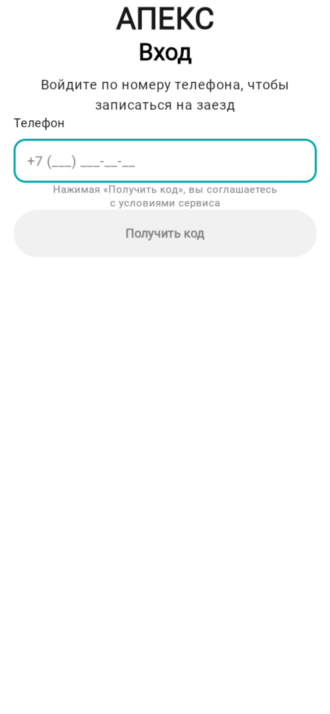
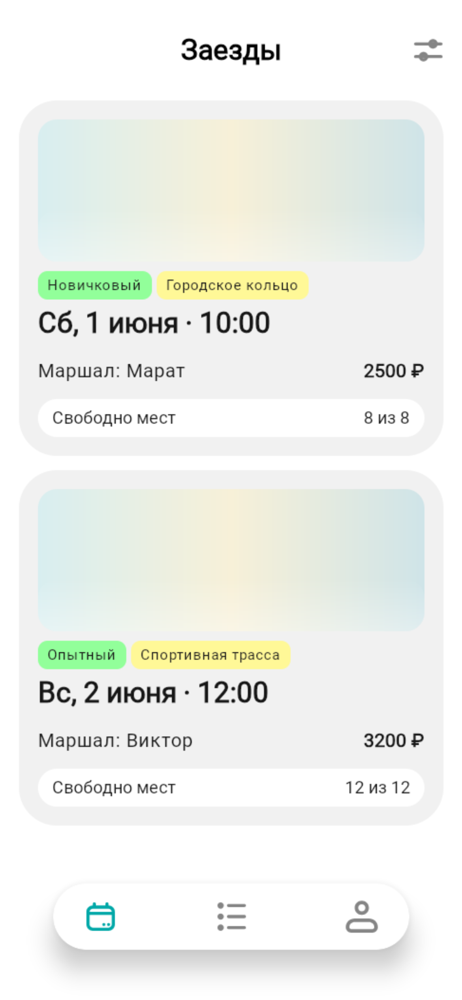
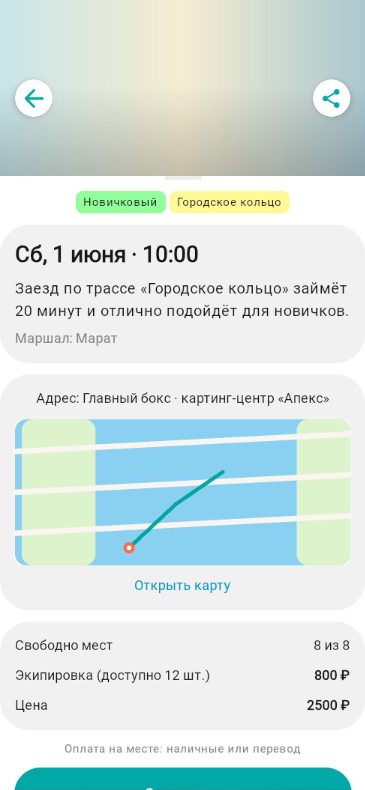

# Картинг-версия «Апекс» — все 3 блока под наш домен

> **Что это.** Наш выбранный домен — **Картинг-центр**. Здесь собрана картинг-версия по всем трём
> блокам школы (аналитика → разработка → тестирование) на одном домене. Приложение — **та же
> кодовая база**, что и референс «Волна» в корне репозитория, переоформленная под картинг (заезды,
> трассы, маршалы, экипировка). Это дополняет основную работу и «связывает блоки» вокруг картинга.

## Три блока (картинг)

| Блок | Где | Что внутри |
|------|-----|------------|
| **1 · Аналитика** | [`../00-analysis-karting/`](../00-analysis-karting/) | требования (BR/FR/NFR/US/UC), архитектура, схема данных, дизайн-брифы, промпты — **свой домен Картинг** |
| **2 · Разработка** | [`02-development/`](02-development/) | доки B1/B2/B3/F1/F2/F3 (симптом/требования/реализация/промпты/проверка) под картинг + ревью |
| **3 · Тестирование** | [`03-testing/`](03-testing/) | ревью требований на тестопригодность + тест-кейсы (MD+YAML) + автотесты |
| Приложение | [`APP.md`](APP.md) | как запустить картинг-версию (порты API :8090 / БД :25432 / веб :8091) |
| Скриншоты | [`screenshots/`](screenshots/) | экраны картинг-приложения (вход, заезды, карта трассы) |

> Блок 1 (аналитика картинга) физически лежит в `00-analysis-karting/` в корне репозитория — здесь
> дана ссылка, чтобы не дублировать. Блоки 2–3 — в этой папке.

## Связь с «Волной»

Приложение картинга = код референса «Волна» (Go backend + Kotlin Multiplatform), переоформленный:
- **данные**: трассы «Городское кольцо» / «Спортивная трасса», маршалы Марат / Виктор, боксы/паддок,
  geometry = контур трассы;
- **UI**: «Прогулки»→«Заезды», «Инструктор»→«Маршал», «прокатная доска»→«экипировка», логотип
  «ВОЛНА»→«АПЕКС», «маршрут»→«трасса»;
- **порты**: API `:8090`, БД `:25432`, веб `:8091` (изоляция от «Волны» на 8080/8081/15432).

Проверено на картинг-инстансе: B1 (dev-код в ответе), F1 (geometry трассы, 6 точек),
`go test ./...` — зелёный; приложение работает на `:8091`.

> Полный исходник картинг-приложения (backend + client) — в отдельном локальном проекте `apex-karting`.
> Здесь, в сданном репозитории, приведены артефакты трёх блоков и скриншоты; сама разработка (те же
> баги/фичи) описана в `02-development/`.

## Скриншоты

  
  
  

Экран входа «АПЕКС» · список «Заезды» (трассы «Городское кольцо» / «Спортивная трасса», маршалы) ·
карточка заезда с **картой трассы по реальной geometry** (F1 + F2).
