# Картинг-версия «Апекс» — все 3 блока под наш домен

> **Что это.** Наш выбранный домен — **Картинг-центр**. Здесь собрана картинг-версия по всем трём
> блокам школы (аналитика → разработка → тестирование) на одном домене. Приложение — **та же
> кодовая база**, что и референс «Волна» в корне репозитория, переоформленная под картинг (заезды,
> трассы, маршалы, экипировка). Это дополняет основную работу и «связывает блоки» вокруг картинга.

## 🚀 Живой деплой

Приложение задеплоено на Render (free tier, без карты):

- **Веб-клиент**: https://apex-web-t7ii.onrender.com
- **API**: https://summer-school-2026.onrender.com

> Бесплатный тариф Render «засыпает» после ~15 минут без запросов — первый заход после паузы
> может занять до минуты на «пробуждение».

## Три блока (картинг)

| Блок | Где | Что внутри |
|------|-----|------------|
| **1 · Аналитика** | [`../00-analysis-karting/`](../00-analysis-karting/) | требования (BR/FR/NFR/US/UC), архитектура, схема данных, дизайн-брифы, промпты — **свой домен Картинг** |
| **2 · Разработка** | [`02-development/`](02-development/) | доки B1/B2/B3/F1/F2/F3/F4/D1 (симптом/требования/реализация/промпты/проверка) под картинг + ревью |
| **3 · Тестирование** | [`03-testing/`](03-testing/) | ревью требований на тестопригодность + тест-кейсы (MD+YAML) + автотесты |
| Код · Go API | [`backend/`](backend/) | тот же слоёный бэкенд «Волны», переоформленный (данные/тексты) + фича «Рекорды трассы» (F4) |
| Код · KMP клиент | [`client/`](client/) | тот же Compose Multiplatform клиент, гоночная тема (D1) + секция лидерборда |
| Приложение | [`APP.md`](APP.md) | как запустить картинг-версию (порты API :8090 / БД :25432 / веб :8091) |
| Скриншоты | [`screenshots/`](screenshots/) | экраны картинг-приложения по этапам: первая версия, гоночная тема, сентябрь 2026 |

> Блок 1 (аналитика картинга) физически лежит в `00-analysis-karting/` в корне репозитория — здесь
> дана ссылка, чтобы не дублировать. Блоки 2–3 — в этой папке.

## Связь с «Волной»

Приложение картинга = код референса «Волна» (Go backend + Kotlin Multiplatform), переоформленный:
- **данные**: трассы «Городское кольцо» / «Спортивная трасса», маршалы Марат / Виктор, боксы/паддок,
  geometry = контур трассы;
- **UI**: «Прогулки»→«Заезды», «Инструктор»→«Маршал», «прокатная доска»→«экипировка», логотип
  «ВОЛНА»→«АПЕКС», «маршрут»→«трасса»;
- **порты**: API `:8090`, БД `:25432`, веб `:8091` (изоляция от «Волны» на 8080/8081/15432).

Проверено на картинг-инстансе: B1 (dev-код в ответе), F1 (geometry трассы, 6 точек),
`go test ./...` — зелёный; приложение работает на `:8091`.

> Полный исходник картинг-приложения — здесь же, в [`backend/`](backend/) и [`client/`](client/).
> Разработка (те же баги/фичи + доменные доработки D1/F4) описана в `02-development/`.

## Скриншоты

<p align="center">
  
  
  
</p>

Экран входа «АПЕКС» · список «Заезды» (трассы «Городское кольцо» / «Спортивная трасса», маршалы) ·
карточка заезда с **картой трассы по реальной geometry** (F1 + F2).

## 🏎️ Доработка: гоночная тема + рекорды трассы (после сдачи)

Продолжение работы над картинг-версией — два улучшения, чтобы «Апекс» перестал быть визуально
перекрашенной «Волной» и получил собственную доменную фичу:

- **D1 · Гоночная тема** — палитра «гоночный красный `#E10600` + графит»; обложки карточек:
  асфальт + красная диагональная полоса + **клетчатая лента финишного флага** (Canvas-арт,
  один переиспользуемый composable); гоночная типографика (CAPS Black Italic, wordmark «АПЕКС•»).
  → [D1-karting-theme.md](02-development/tasks/D1-karting-theme.md)
- **F4 · Рекорды трассы (лидерборд)** — full-stack фича, которой **нет в референсе**: таблица
  `lap_results`, `GET /routes/{id}/leaderboard` (лучший круг гонщика по конфигурации, топ-10),
  секция **«🏁 Рекорды трассы»** в карточке заезда. Демо: Сергей 41.890 (P1) · Иван 42.318 ·
  Ольга 43.005. → [F4-track-leaderboard.md](02-development/tasks/F4-track-leaderboard.md)

<p align="center">
  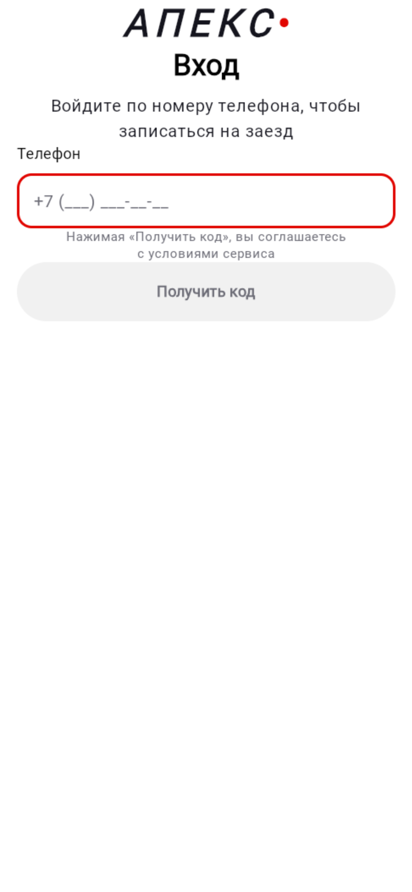
  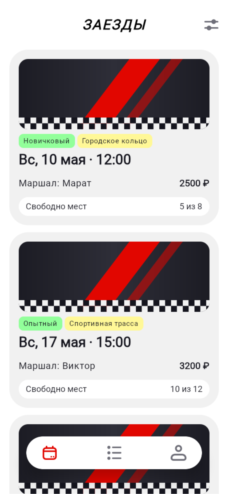
  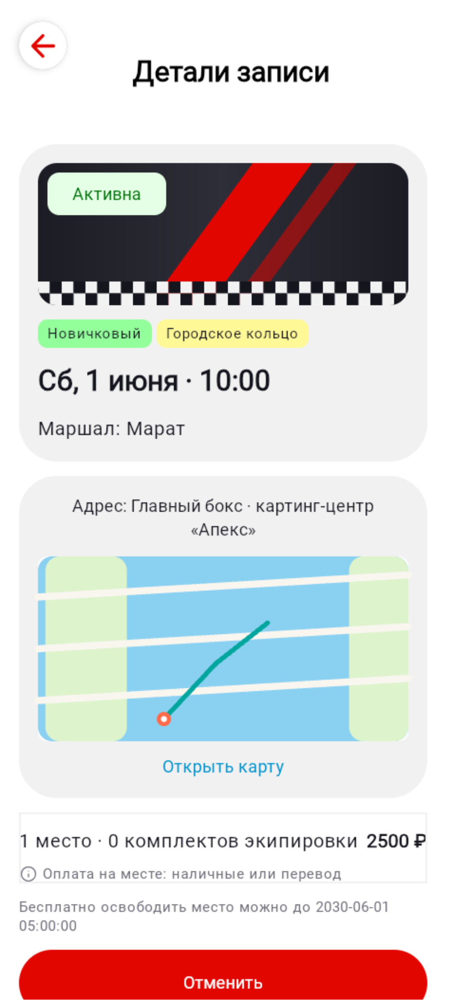
</p>

Проверено: `go test ./...` — зелёный (включая урок «сид не кладут в миграцию», пойманный тестами —
см. F4), wasmJs — BUILD SUCCESSFUL, живой прогон на `:8091`.

## 🌙 Сентябрь 2026: тёмная тема, вход без SMS, паспорт трассы

Снято на [живом приложении](https://apex-web-t7ii.onrender.com) — iPhone, 390×844 @3x.

<p align="center">
  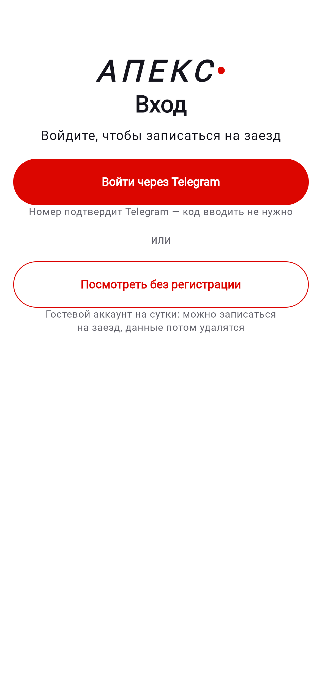
  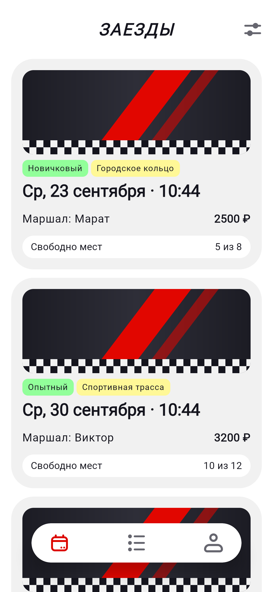
  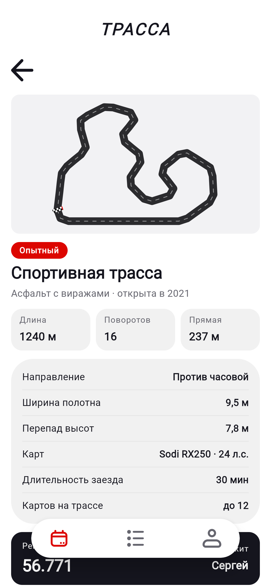
</p>
<p align="center">
  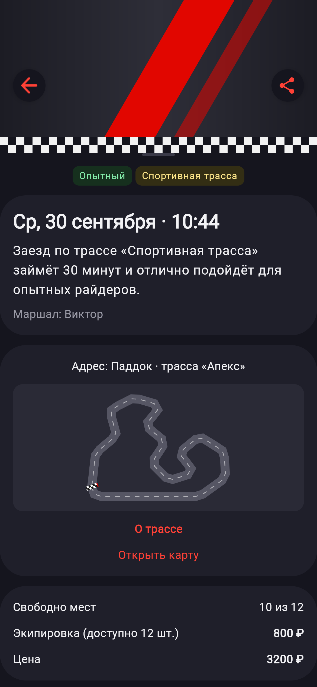
  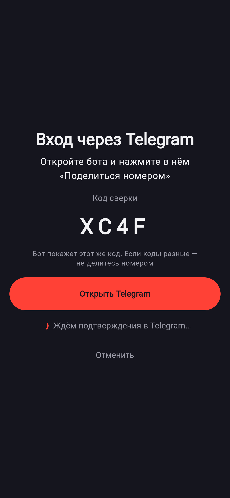
  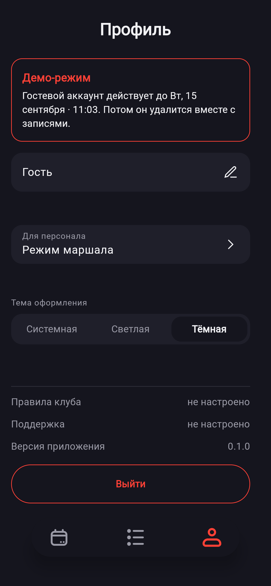
</p>

- **Вход без SMS** — «Войти через Telegram»: номер подтверждает Telegram, приложение показывает
  код сверки, бот — тот же код и кнопку «Поделиться номером». «Посмотреть без регистрации» —
  личный гостевой аккаунт на сутки (плашка «Демо-режим» в профиле).
- **Паспорт трассы (F5)** — длина, повороты и главная прямая считаются из геометрии схемы.
- **Тёмная тема «Графит»** — выбор «Системная / Светлая / Тёмная» в профиле, контраст по WCAG AA.
- **Каталог** показывает только предстоящие заезды (прошедшие нужны лишь режиму маршала).

## 🔔 Уведомления, лист ожидания и наблюдаемость

Всё это работает через бота [@apex_karting_bot](https://t.me/apex_karting_bot), того же, через
которого выполняется вход.

<p align="center">
  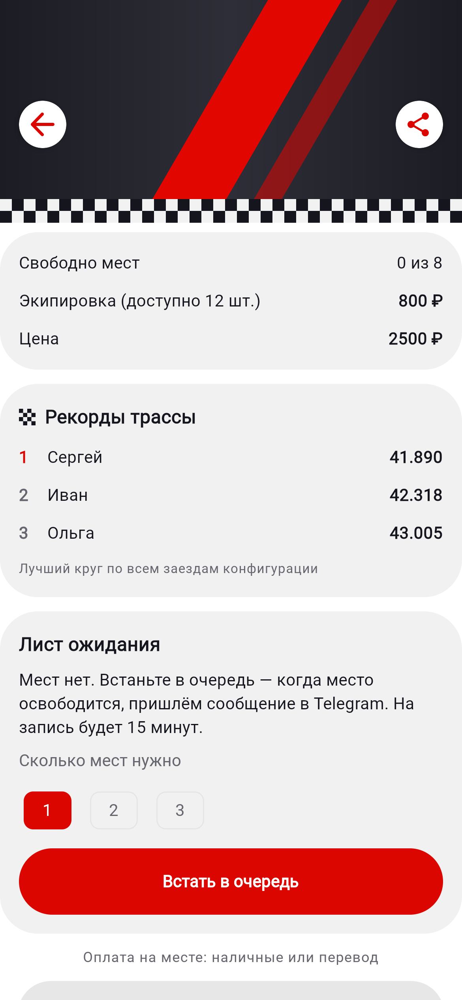
  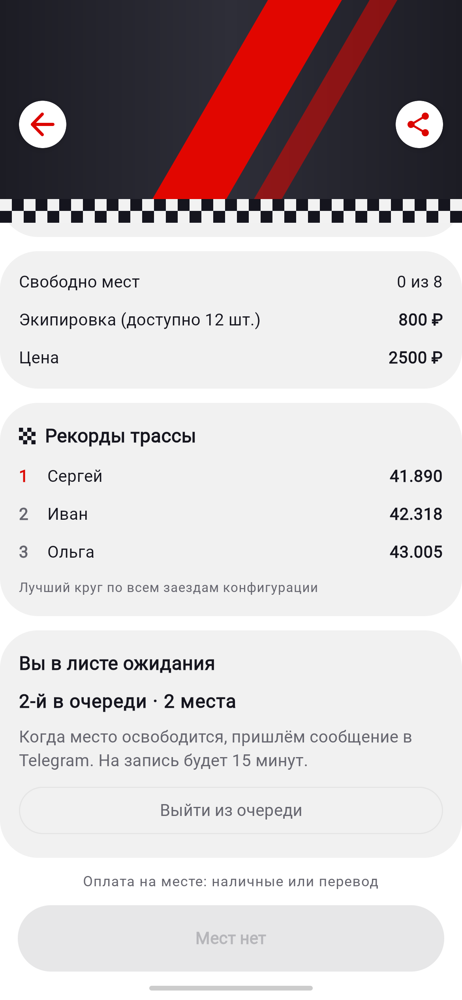
  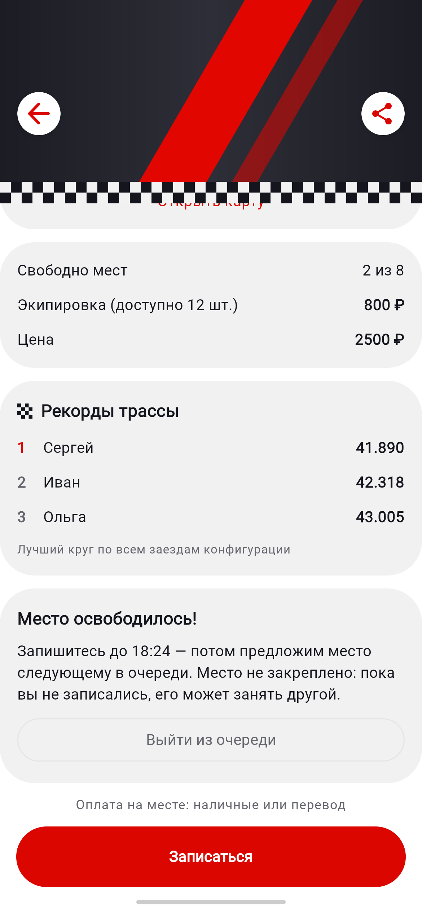
</p>
<p align="center">
  <sub>Лист ожидания: мест нет · «2-й в очереди» · место освободилось, запись открыта. Снято на локальном стенде с данными из сида, 390×844 @3x.</sub>
</p>

**Что умеет бот:**

- **Подтверждение брони** сразу после записи: трасса, время по Москве, место сбора, маршал,
  места и экипировка, сумма.
- **Напоминание за 2 часа до старта.** Приходит, если бронь сделана больше чем за 3 часа до
  заезда, иначе оно почти совпало бы с подтверждением.
- **Сообщение об отмене.** При поздней отмене (меньше чем за 2 часа) объясняет, что место
  не освободилось.
- **Кнопка «Отменить бронь»** под подтверждением и напоминанием. Нажатие спрашивает
  «Да, отменить / Нет, оставить», потому что одно случайное нажатие не должно отменять
  заезд. Отмена та же, что в приложении: место возвращается, приходит сообщение, лист
  ожидания получает предложение.
- **Лист ожидания.** Если мест нет, в заезд можно встать в очередь на 1–3 места. Когда место
  освобождается, предложение получает первый в очереди, кому хватает мест. У него 15 минут,
  потом место предлагается следующему. Место не закрепляется: пока человек не записался,
  его может занять любой, и сообщение говорит об этом прямо. Ссылка в сообщении ведёт сразу
  на экран заезда.
- **`/stop` и `/notify`** отключают и включают уведомления.

**Для администратора:**

- **`/stats`** — сводка: брони и отмены за сутки и неделю, заполняемость заездов на неделю,
  лист ожидания, клиенты, отправки в Telegram, запросы и ошибки API.
- **Алерты в Telegram:** всплеск ошибок 5xx, паника, сбои рассылки, ошибки базы, выкладка
  новой версии. Один и тот же алерт приходит не чаще раза в 30 минут, в тексте только шаблон
  маршрута (`GET /slots`), без id и номеров.

<details>
<summary>Как выглядят сообщения бота (реальный вывод со стенда)</summary>

```text
✅ Бронь подтверждена

🏁 Городское кольцо
🗓 среда, 23 сентября, 17:58 (мск)
📍 Сбор: Главный бокс · картинг-центр «Апекс»
🚩 Маршал: Марат
🎟 Мест: 2, с экипировкой: 1
💳 Сумма: 5 800 ₽

Напомню о заезде за 2 часа до старта.

Отключить уведомления: /stop
                                   [ Отменить бронь ]
```

```text
🎉 Освободилось место в заезде!

🏁 Городское кольцо
🗓 среда, 23 сентября, 17:58 (мск)
📍 Сбор: Главный бокс · картинг-центр «Апекс»
🚩 Маршал: Марат
🎟 Свободно мест: 2, вы ждали: 2

Запишитесь в течение 15 минут — до 18:24 (мск). Потом предложим место следующему в очереди.
Место не закреплено: пока вы не записались, его может занять другой.

Записаться: https://apex-web-t7ii.onrender.com/#slot/<id заезда>
```

```text
⚠️ API: 5 ошибок 5xx за 5 минут. Последняя: GET /slots → 500.

Повтор этого алерта — не раньше чем через 30 мин.
```

</details>

### Как это устроено

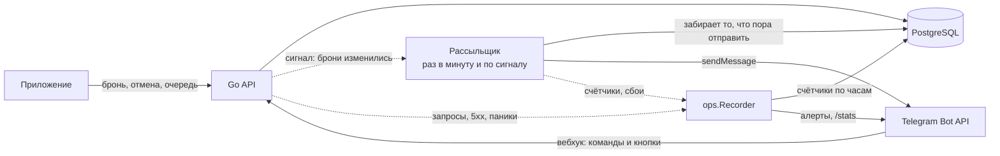

Одна фоновая задача обслуживает уведомления, лист ожидания и счётчики. Главные решения
и почему они такие:

| Решение | Почему |
|---|---|
| **Очереди сообщений нет:** отметки `confirm/reminder/cancel_notified_at` лежат в самих бронях | Бесплатный Render засыпает. После пробуждения рассыльщик просто дочитывает из базы всё, что ещё актуально. Отдельный брокер пришлось бы держать живым, а здесь нечему теряться. |
| **Сначала отметка, потом отправка**, захват через `FOR UPDATE SKIP LOCKED` | Одно уведомление не уйдёт дважды даже при нескольких экземплярах сервиса. При временном сбое Telegram отметка снимается, и отправка повторяется на следующем проходе. |
| **Отмечаются и брони клиентов без Telegram** | Иначе они навсегда оставались бы в частичных индексах и попадали в каждую выборку. |
| **Сигнал после брони или отмены** в дополнение к расписанию | Подтверждение приходит за секунды, а не через минуту. Сигнал не блокирует запрос. |
| **Освободившиеся места рассыльщик ищет сам**, а не по событию «отмена» | Места освобождаются и при отмене, и при удалении аккаунта, и при уборке гостей. Проверка «есть места и есть очередь» ловит все случаи сразу. |
| **Кнопки проверяются по чату, а не по данным кнопки** | Данные кнопки приходят от клиента Telegram и подделываются. Бронь ищется только среди броней того клиента, к которому привязан чат. |
| **Внешнего мониторинга нет** | Частые проверки снаружи не дали бы Render засыпать и съели бы бесплатный лимит часов. Цена этого решения — полное падение сервиса отсюда не видно. |
| **Счётчики копятся в памяти** и пишутся в базу раз в 30 секунд и при остановке | Запросы не ждут записи в базу, а при засыпании Render события не теряются (проверено остановкой контейнера). |

**Как проверено:** модульные и интеграционные тесты бэкенда на PostgreSQL и 91 тест клиента,
все зелёные в CI. Каждый сценарий дополнительно прогнан вживую на локальном стенде с
имитатором Telegram Bot API:
- бронь → подтверждение с кнопкой → отмена кнопкой, в том числе попытка из чужого чата;
- очередь из двух человек → отмена брони → предложение первому → запись по предложению;
- падение базы → алерт администратору → повтор алерта подавлен.

**Нагрузка:** k6, 224 пользователя бьются за места в трёх заполненных заездах, 31 657 запросов
за 3 минуты без ошибок, 7 инвариантов после прогона без нарушений →
[отчёт](03-testing/load-test-waitlist.md).

**Ограничения, о которых стоит знать.** Пока Render спит, напоминание и передача
предложения следующему ждут, пока кто-нибудь откроет сайт. Бронь и отмена сами будят
сервис, поэтому подтверждения и отмены приходят сразу. Гость (демо-вход) встать в очередь
не может: у него нет Telegram. Чаты тех, кто входил через Telegram до появления уведомлений,
миграция подхватила только из запросов входа за последние сутки: остальным достаточно один раз
войти через Telegram заново.

### Переменные окружения API

| Переменная | Зачем | Где задаётся |
|---|---|---|
| `TELEGRAM_BOT_TOKEN` | вход через Telegram, уведомления, лист ожидания, алерты. Пусто — всё это выключено | панель Render (секрет) |
| `ADMIN_TELEGRAM_CHAT_ID` | чат администратора для `/stats` и алертов. Свой id бот пришлёт по `/whoami` | панель Render |
| `ALLOWED_ORIGIN` | адрес фронтенда: CORS и ссылки из сообщений бота | `render.yaml` |
| `RENDER_GIT_COMMIT` / `APP_VERSION` | версия в `/stats` и в сообщении о выкладке | Render задаёт сам / вручную |
